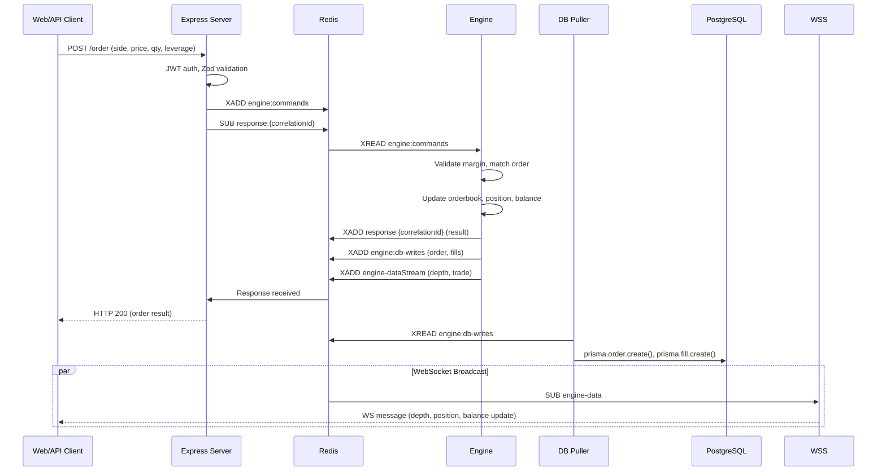
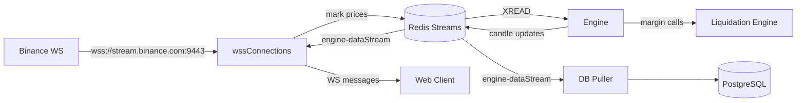

# Coinbook — Perpetual Futures Trading Platform

A full-stack **perpetual futures exchange** with an in-memory order-matching engine, real-time Binance price feeds, Redis-based microservice orchestration, PostgreSQL persistence, and a Next.js trading dashboard.

## Tech Stack

| Layer | Technology |
|-------|-----------|
| Runtime | [Bun](https://bun.sh) 1.3.13 |
| Monorepo | [Turborepo](https://turbo.build/repo) |
| Frontend | Next.js 16, React 19, Tailwind CSS v4 |
| Charts | TradingView Lightweight Charts |
| API Server | Express 5 |
| Matching Engine | TypeScript (in-memory, CLOB) |
| Database | PostgreSQL 16 + Prisma ORM |
| Cache/Queue | Redis 7 |
| Price Feeds | Binance WebSocket API |
| Auth | JWT + bcrypt |

## Architecture

```
┌──────────────────────────────────────────────────────────────────────────┐
│                          CLIENTS                                        │
│  ┌──────────┐                   ┌─────────────────────────────────┐     │
│  │ Browser  │                   │  Trading Bot / API Clients      │     │
│  │ (Next.js)│                   └──────────┬──────────────────────┘     │
│  └────┬─────┘                              │                            │
│       │                     HTTP (3000)     │                            │
│       │ WebSocket (3002)                    │                            │
└───────┼─────────────────────────────────────┼────────────────────────────┘
        │                                     │
┌───────▼─────────────────────────────────────▼────────────────────────────┐
│                                                                          │
│  ┌──────────────────┐      ┌──────────────────────────────────────────┐  │
│  │  WSS Connections  │      │           Express Server (3000)          │  │
│  │  (WebSocket Svr)  │      │  ┌──────────┐  ┌────────────────────┐   │  │
│  │                   │      │  │JWT Auth  │  │  REST Handlers     │   │  │
│  │  • engineDataBridge│      │  │Middleware│  │  • order/depth     │   │  │
│  │  • Binance Feeds  │      │  └──────────┘  │  • positions/bal   │   │  │
│  │  • Client WS      │      │                 │  • candles/fills   │   │  │
│  └────────┬─────────┘      │                 └────────┬───────────┘   │  │
│           │                └──────────────────────────┼────────────────┘  │
│           │                           Redis            │                  │
│           │                     ┌──────┴──────┐        │                  │
│           │                     │  Streams /  │        │                  │
│           │                     │  Pub/Sub    │        │                  │
│           │                     └──────┬──────┘        │                  │
│           │                            │               │                  │
│  ┌────────▼────────────────────────────▼───────────────▼──────────────┐  │
│  │                          ENGINE                                      │  │
│  │  ┌──────────────┐  ┌───────────┐  ┌──────────┐  ┌──────────────┐  │  │
│  │  │  exchangeStore│  │  Matching  │  │ Funding  │  │  Liquidation  │  │  │
│  │  │  (In-Memory)  │  │  Engine   │  │  Rate    │  │  Engine      │  │  │
│  │  └──────────────┘  └───────────┘  └──────────┘  └──────────────┘  │  │
│  └────────────────────────────────┬────────────────────────────────────┘  │
│                                   │                                       │
│                         ┌─────────▼─────────┐                            │
│                         │    DB Puller       │                            │
│                         │  (Redis→PostgreSQL)│                            │
│                         └─────────┬─────────┘                            │
│                                   │                                       │
│                         ┌─────────▼─────────┐                            │
│                         │    PostgreSQL      │                            │
│                         │  • Users           │                            │
│                         │  • Orders          │                            │
│                         │  • Fills           │                            │
│                         │  • Candles         │                            │
│                         └───────────────────┘                            │
│                                                                          │
└──────────────────────────────────────────────────────────────────────────┘
```

## Project Structure

```
apps/
├── engine/          # Order-matching engine (in-memory CLOB)
│   ├── exchangeStore.ts   # All live state (orderbooks, balances, positions)
│   ├── handler/           # Command handlers (createOrder, cancelOrder, etc.)
│   └── helper/            # priceFeed, fundingRate, liquidation, snapshot
├── server/          # Express REST API (port 3000)
│   ├── routes/            # engine.routes.ts, user.routes.ts
│   ├── controllers/       # Request handling logic
│   └── handler/           # Redis loopback bridge + DB queries
├── web/             # Next.js 16 trading dashboard
│   ├── app/               # (auth)/login, (auth)/signup, (dashboard)/trade
│   ├── components/        # auth, layout, trading, ui
│   ├── context/           # AuthContext, MarketContext
│   └── hooks/             # useOrderbook, usePositions, useWebSocket, etc.
├── wssConnections/  # WebSocket server (port 3002)
│   └── src/               # clientWs, engineDataBridge, pricefeed
├── db-puller/       # Redis stream → PostgreSQL persister
└── simulator/       # Trading bot with 5 strategies (MM, momentum, etc.)

packages/
├── db/              # Prisma schema + client (User, Order, Fill, Candle)
├── redis/           # Redis client factory
├── ui/              # Shared React components
├── eslint-config/   # Shared ESLint configs
└── typescript-config/ # Shared TS configs
```

## Data Flow

### Order Lifecycle



### Price Feed & Real-time Updates



## Getting Started

### Prerequisites

- [Bun](https://bun.sh) 1.3.13+
- [Docker](https://docker.com) + Docker Compose
- [Turbo](https://turbo.build/repo) (optional, for global turbo commands)

### Quick Start

```sh
# Start infrastructure + all services
docker compose up -d

# Or run services individually with turborepo:
bun install
bun run dev
```

### Services

| Service | Port | Description |
|---------|------|-------------|
| Server | `3000` | Express REST API |
| Web | `5173` | Next.js dev server |
| WSS | `3002` | WebSocket server |
| PostgreSQL | `5432` | Database |
| Redis | `6379` | Cache / message broker |

### Database

```sh
# Run migrations
cd packages/db && bunx prisma migrate deploy

# Open Prisma Studio
bunx prisma studio
```

## API Endpoints

| Method | Path | Auth | Description |
|--------|------|------|-------------|
| POST | `/signup` | — | Create account |
| POST | `/signin` | — | Login |
| POST | `/onRamp` | JWT | Deposit USD |
| POST | `/order` | JWT | Create order (market/limit, long/short) |
| DELETE | `/order` | JWT | Cancel limit order |
| GET | `/equity/available` | JWT | Available balance |
| GET | `/positions/:marketId` | JWT | Position for symbol |
| GET | `/depth/:marketId` | — | Order book depth |
| GET | `/candles/:marketId` | — | Candle history |
| GET | `/orders/all` | JWT | All user orders |
| GET | `/orders/open/:marketId` | JWT | Open orders for symbol |
| GET | `/orders/:marketId` | JWT | Order history for symbol |
| GET | `/fills` | JWT | Fill history |

## Simulator

A built-in trading bot simulates market activity with 5 strategies:

```sh
docker compose exec engine bun run apps/simulator/index.ts
```

Strategies: Market Maker, Momentum, Mean Reversion, Scalper, Retail Trader.
